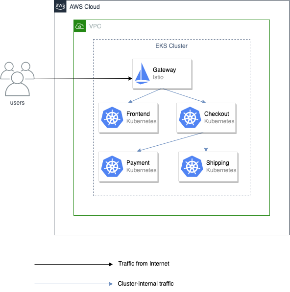

# Istio Implementation if application expands to multiple microservices

If the application expands to multiple microservices we can implement Istio as an ingress Gateway.

For the implementation following steps are needed to be achieved:

1. Install istio in the cluster
2. Implement a Gateway resource for the application
3. Add VirtualService resource for the deployment (in this case, front-end application) which has the gateway resource linked
4. When installing Istio we need to ensure expandMesh parameter is set