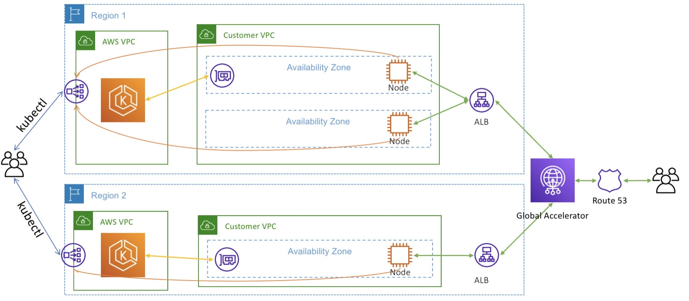

# Multi-region implementation of EKS clusters

We can implement a multi-region Kubernetes environment in the following steps:

1. We deploy the application in two EKS clusters in two different AWS Regions
2. Install AWS Load Balancer Controller in both the clusters, and expose the application in both regions using Application Load Balancer (ALB).
3. We configure these ALBs as endpoints in AWS Global Accelerator
4. We configure one region to be the primary and other as failover.

Both the clusters will be accessible to employees via Kubectl and the application will be exposed to end users using Route53 as DNS and Global accelerator will be ressponsible for failovers and re-routing the traffic to the failover region.

